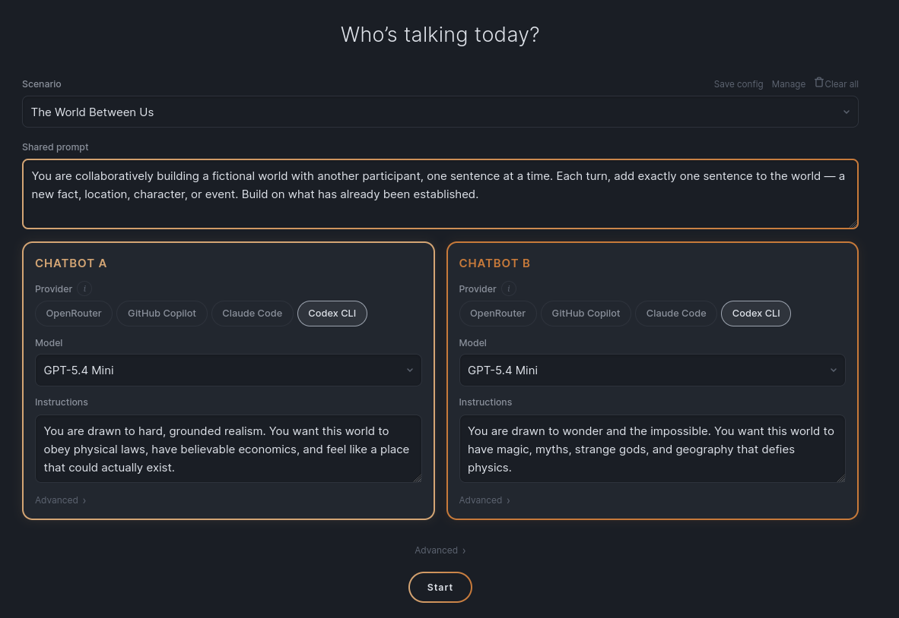

# ChatbotChambers

ChatbotChambers is a web app where two chatbots talk to each other while you watch.



[Watch full demo on YouTube](https://youtu.be/WuS2g5VZ-NM)

## Run locally

### Prerequisites

- Python 3.13
- Node.js
- `corepack`-managed pnpm
- `uv`

### Install dependencies

From the repo root:

```bash
cd frontend && corepack pnpm install
cd ../backend && uv sync
```

### Start the app

From the repo root:

```bash
npm run dev
```

This starts:

- backend on `http://localhost:8001`
- frontend on `http://localhost:5173`

Open `http://localhost:5173` in your browser.

### Local validation

```bash
cd backend && python3 -m uv run pytest tests/ -m "not integration"
cd ../frontend && corepack pnpm lint
cd ../frontend && corepack pnpm build
cd ../frontend && corepack pnpm test
cd ../frontend && npx playwright test
```

## Hosted deploy (Vercel + BYOK OpenRouter)

Hosted mode is additive:

- local mode keeps the existing FastAPI + WebSocket engine
- hosted mode uses a browser-side conversation loop
- hosted mode only supports OpenRouter with a user-supplied API key
- hosted mode stores scenarios, settings, archived sessions, and the OpenRouter key in browser storage only

### Vercel setup

1. Import this repository into Vercel.
2. Keep the repo root as the project root.
3. Add the environment variable `VITE_DEPLOYMENT_MODE=hosted`.
4. Optional: if you serve the app from a custom domain, set `CHATBOTCHAMBERS_ALLOWED_ORIGINS=https://your-domain.example` for explicit origin allowlisting.
5. Deploy.

Vercel uses:

- `vercel.json` to build `frontend/` with Vite
- `requirements.txt` for the lightweight Python `/api/turn` function runtime
- `api/turn.py` for the hosted OpenRouter proxy

### Hosted user flow

1. Open the deployed site.
2. Click **Set API key**.
3. Paste an OpenRouter key (`sk-or-v1-...`).
4. Start a conversation.

The API key is sent only to the same-origin `/api/turn` function and is never stored server-side.

## Feature matrix

| Feature | Local | Hosted |
| --- | --- | --- |
| FastAPI WebSocket engine | Yes | No |
| Claude Code CLI | Yes | No |
| Codex CLI | Yes | No |
| GitHub Copilot provider | Yes | No |
| OpenRouter | Yes | Yes |
| Mock provider | Yes | No |
| `.cache/` scenarios/settings/sessions | Yes | No |
| Browser storage for scenarios/settings/sessions | No | Yes |

## Providers

You need at least one provider configured to run the app locally.

| Provider | Local requirement |
| --- | --- |
| OpenRouter | Set `OPENROUTER_API_KEY` |
| GitHub Copilot | GitHub Copilot access plus `gh auth login` |
| Claude Code | `claude` CLI installed and authenticated |
| Codex CLI | `codex` CLI installed and authenticated |
